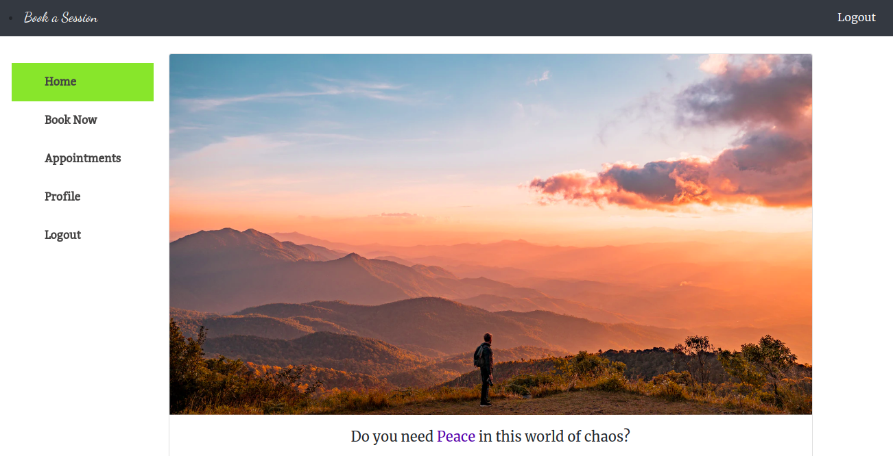

# Book a Counseling Session Frontend
> The app is about booking a counseling session with experts in many fields. This is the front-end of an app made using react and redux. The front-end will contact the back-end rails app using Rest APIs. The back-end of can be found [here](https://github.com/DanielMitiku/book-a-counseling-session-backend.git). 


## Built with
- React
- Redux
- Javascript
- npm
- node

## Demo

🔥 [Demo](https://book-a-session-rails-react.herokuapp.com/)

## Screenshot



## Get Started 

*First Clone the backend repo to your local machine. Full instructions can be found by visiting the [repo](https://github.com/DanielMitiku/book-a-counseling-session-backend.git)*
```bash
    git clone https://github.com/DanielMitiku/book-a-counseling-session-backend.git
    cd book-a-counseling-session-backend
```
- Please install Postgres db in your computer and add the appropriate config to the *config/database.yml* file

*Install `gems` packages, migrate database and start development server*

```bash
    bundle install
    rails db:create
    rails db:migrate
    rails s
```

*Clone the frontend repo to your local machine*
```bash
    git clone https://github.com/DanielMitiku/book-a-counseling-session-frontend.git
    cd book-a-counseling-session-frontend
```

*Install the necessary packages and start development server*

```bash
    npm install
    npm start
```

*Open development server in your browser*

Open http://localhost:3000 in your browser.

## Current Features

- Authentication using JWT
- Users can book appontments
- Users can see their scheduled appontments
- Users can delete their scheduled appointments
- Admins can add/remove the sessions users will book
- Admins can delete the appointments users booked
- Admins can remove users ...

## Features you can add

- Update the UX and UI for better experience
- making each user have its own timezone ...

## Author

- Github: [Daniel Mitiku](https://github.com/DanielMitiku)
- LinkedIn: [@daniel-wesego](https://www.linkedin.com/in/daniel-wesego/)
- Email: wedanielmitiku@gmail.com

## 🤝 Contributing

- Contributions, issues and feature requests are welcome!

- Feel free to create PR.

## Show your support

- Give a ⭐️ if you like this project and follow me on [Github](https://github.com/DanielMitiku) for more projects like this.

## 📝 License

- This project is [MIT](lic.url) licensed.
